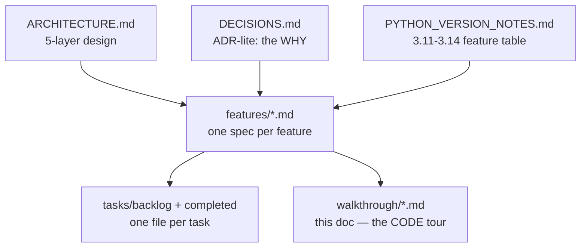

[Index](README.md) · ← Previous: [Index](README.md) · Next → [Producer](02-producer.md)

---

# Project layout

## The code

- **`trade-pipeline/`** — the actual code. A `uv`-managed Python project, `requires-python
  ">=3.11,<3.15"` ([pyproject.toml](../../trade-pipeline/pyproject.toml)).

## The docs system

Everything under `docs/` (this walkthrough included) is one system, cross-referencing itself so
nothing has to be re-derived or guessed across sessions:



- **[ARCHITECTURE.md](../ARCHITECTURE.md)** — the 5-layer system design, and where Temporal/Dagster
  fit (and deliberately don't).
- **[DECISIONS.md](../DECISIONS.md)** — one entry per non-obvious choice (Redis vs DB dedup, RS256 vs
  HS256, Argon2id vs bcrypt, pure ASGI vs `BaseHTTPMiddleware`, custom rate limiter vs `slowapi`...).
  When this walkthrough says "chosen because X," the full reasoning is there.
- **[PYTHON_VERSION_NOTES.md](../PYTHON_VERSION_NOTES.md)** — the 3.11→3.14 feature-availability table
  code comments cite instead of guessing from memory.
- **[features/](../features/)** — one spec doc per feature, written *before* implementation
  (problem/scope/design/version-notes/testing-plan), created via the `create-feature` skill.
- **[tasks/backlog/](../tasks/backlog/) and [tasks/completed/](../tasks/completed/)** — one file per
  task; a task moves from backlog to completed when done (`update-task` skill).
- **[CODING_STANDARDS.md](../CODING_STANDARDS.md)** / **[GIT_PRACTICES.md](../GIT_PRACTICES.md)** —
  ruff/pytest conventions and commit/branch conventions.

## `trade-pipeline/` package layout

```
trade-pipeline/
  pyproject.toml, uv.lock        — uv-managed deps, requires-python 3.11-3.14
  docker-compose.yml             — Kafka (KRaft), Redis, Postgres (infra only)
  Dockerfile                      — one image, every entrypoint (producer/consumer/API/Dagster)
  .env.example                    — documents every setting; copy to .env for local overrides
  keys/                          — RSA keypair for JWT RS256 (gitignored, generate locally)
  src/trade_pipeline/
    producer/       — Component 1: Kafka producer          → page 2
    consumer/       — Component 2: dedup consumer + sink    → page 3
    api/            — Component 3: FastAPI + auth           → page 4
    enrichment/     — Component 4: hand-rolled + Temporal   → page 5
    common/         — shared models, config, db_models, version_compat_demo → pages 3, 6
    observability/  — Component 5: consumer Prometheus metrics → page 3
    dagster_pipeline/ — Component 6: cold-storage archival job → page 6
  tests/                          — mirrors src/ layout exactly → page 7
```

Every subpackage under `src/trade_pipeline/` has a matching directory under `tests/` with the same
name — `tests/producer/` tests `src/trade_pipeline/producer/`, and so on.

---
[Index](README.md) · ← Previous: [Index](README.md) · Next → [Producer](02-producer.md)
