[Index](README.md) · ← Previous: [Project layout](01-project-layout.md) · Next → [Consumer & storage](03-consumer-and-storage.md)

---

# Producer

**File**: [`src/trade_pipeline/producer/fake_trades.py`](../../trade-pipeline/src/trade_pipeline/producer/fake_trades.py)
**Feature doc**: [docs/features/kafka-producer.md](../features/kafka-producer.md)
**Tests**: [`tests/producer/test_fake_trades.py`](../../trade-pipeline/tests/producer/test_fake_trades.py) (7 tests)

## What it does

Simulates N broker feeds publishing trade events to Kafka — since a real learning project can't hook
up real market data, this generates fake ones and, on purpose, re-sends ~5% of them unchanged to
simulate duplicate delivery from a broker. That duplicate stream is what the consumer's Redis dedup
exists to handle (see [page 3](03-consumer-and-storage.md)).

## Flow

```mermaid
flowchart LR
    Loop[event loop: N iterations]
    Gen[generate_trade&#40;&#41;<br/>random symbol/qty/price]
    Dup{~5% chance:<br/>reuse a recent event?}
    Ser[_serialize&#40;&#41;<br/>Decimal→str, datetime→isoformat]
    Kafka[(Kafka topic)]

    Loop --> Dup
    Dup -->|no| Gen --> Ser
    Dup -->|yes| Ser
    Ser --> Kafka
```

## Code references

- [`generate_trade(broker_id)`](../../trade-pipeline/src/trade_pipeline/producer/fake_trades.py#L40) —
  builds one random `TradeEvent` for a given broker id.
- [`run_producer(...)`](../../trade-pipeline/src/trade_pipeline/producer/fake_trades.py#L50) — the main
  loop: keeps a rolling window of the last 50 events (`last_events`), and with `DUPLICATE_RATE = 0.05`
  probability re-emits one verbatim instead of generating a new one.
- [`_serialize(event)`](../../trade-pipeline/src/trade_pipeline/producer/fake_trades.py#L28) — JSON
  encoding; `Decimal` and `datetime` aren't JSON-native so they're converted to `str`/`isoformat()`
  here and decoded back symmetrically in the consumer's
  [`_deserialize`](../../trade-pipeline/src/trade_pipeline/consumer/dedup_consumer.py#L26).
- Uses the plain synchronous `confluent_kafka.Producer` (poll/produce loop) — **not** the beta
  `AIOProducer` API. See [DECISIONS.md](../DECISIONS.md) and
  [features/kafka-producer.md](../features/kafka-producer.md) for why.

## The shared model

**File**: [`src/trade_pipeline/common/models.py`](../../trade-pipeline/src/trade_pipeline/common/models.py)

[`TradeEvent`](../../trade-pipeline/src/trade_pipeline/common/models.py#L15) is a frozen, slotted
dataclass (`@dataclass(frozen=True, slots=True)`) — immutable, memory-efficient, appropriate for a
high-volume short-lived message. Its
[`dedup_key()`](../../trade-pipeline/src/trade_pipeline/common/models.py#L34) method
(`trade:{broker_id}:{trade_id}`) is the exact Redis key format the consumer's dedup check uses — see
[page 3](03-consumer-and-storage.md).

---
[Index](README.md) · ← Previous: [Project layout](01-project-layout.md) · Next → [Consumer & storage](03-consumer-and-storage.md)
