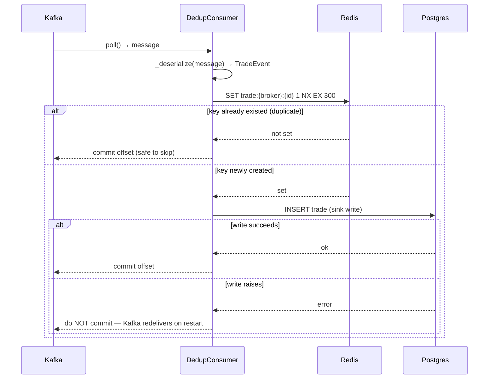
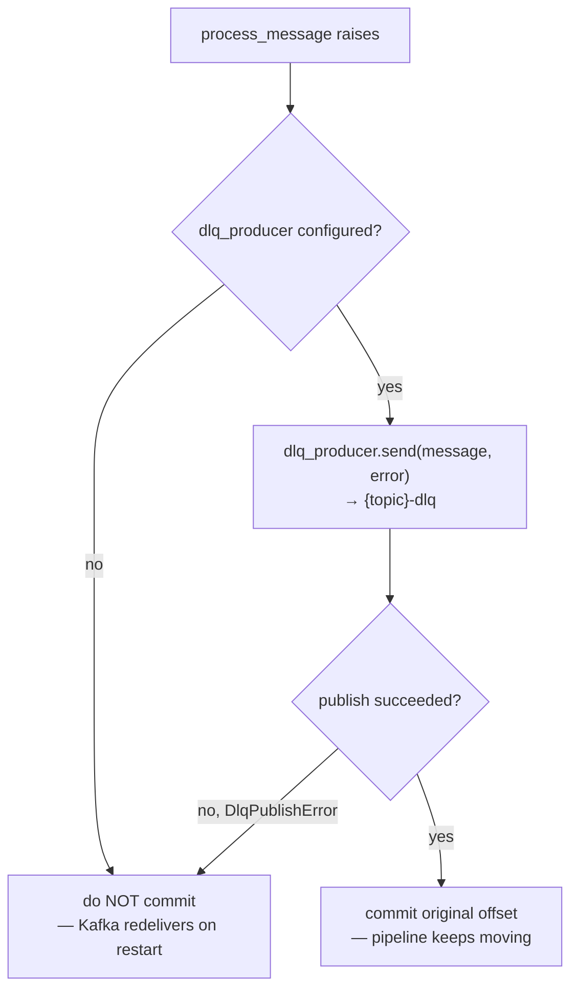

[Index](README.md) · ← Previous: [Producer](02-producer.md) · Next → [API & auth](04-api-and-auth.md)

---

# Consumer & storage

**Files**:
[`src/trade_pipeline/consumer/dedup_consumer.py`](../../trade-pipeline/src/trade_pipeline/consumer/dedup_consumer.py),
[`src/trade_pipeline/consumer/postgres_sink.py`](../../trade-pipeline/src/trade_pipeline/consumer/postgres_sink.py),
[`src/trade_pipeline/common/db_models.py`](../../trade-pipeline/src/trade_pipeline/common/db_models.py)
**Feature doc**: [docs/features/dedup-consumer.md](../features/dedup-consumer.md)
**Tests**: [`tests/consumer/`](../../trade-pipeline/tests/consumer/) (7 tests)

## What it does

Reads trade events off Kafka, drops the ones the producer intentionally duplicated, and writes
everything else to Postgres — with a hard guarantee that a crash never silently loses an event.

## Flow

## Code references — dedup logic

- [`DedupConsumer.is_duplicate(event)`](../../trade-pipeline/src/trade_pipeline/consumer/dedup_consumer.py#L61) —
  the atomic check: `redis.set(key, 1, nx=True, ex=ttl)`. This is the plan's `SETNX ... EX 300`
  spelled with redis-py's current API (see [DECISIONS.md](../DECISIONS.md) "Redis SETNX for dedup").
- [`DedupConsumer.process_message(message)`](../../trade-pipeline/src/trade_pipeline/consumer/dedup_consumer.py#L68) —
  the sequencing: dedup check → sink write → return whether to commit. Duplicates are committed past
  immediately (nothing to redo); a real write only commits *after* it succeeds.
- [`run_consumer(...)`](../../trade-pipeline/src/trade_pipeline/consumer/dedup_consumer.py#L84) — the
  real Kafka wiring: `enable.auto.commit: False`, and `consumer.commit(message=message)` is only
  called when `process_message` returns without raising. This is the load-bearing behavior for
  at-least-once delivery.
- [`DedupStats`](../../trade-pipeline/src/trade_pipeline/consumer/dedup_consumer.py#L42) — tracks
  `processed`/`duplicates` counts, exposes `dedup_hit_rate`.

## Code references — Postgres sink

- [`Trade`](../../trade-pipeline/src/trade_pipeline/common/db_models.py) ORM model — lives in
  `common/` (not under `consumer/`) specifically because it's shared: the sync consumer sink and the
  async API both use the same table definition. SQLAlchemy table definitions are engine-agnostic;
  only the Session/Engine machinery differs.
- [`make_sink(engine)`](../../trade-pipeline/src/trade_pipeline/consumer/postgres_sink.py#L52) — returns
  the callable wired as `DedupConsumer`'s sink. Uses **sync** SQLAlchemy with the `psycopg` (v3)
  driver, not async `asyncpg` — the consumer's poll loop is a plain blocking loop, not an event loop,
  so an async driver would need its own bridged event loop for no benefit. See
  [DECISIONS.md](../DECISIONS.md) "Sync psycopg for the consumer... async asyncpg for the API."
- [`DuplicateTradeError`](../../trade-pipeline/src/trade_pipeline/consumer/postgres_sink.py#L29) — a DB
  unique constraint on `(broker_id, trade_id, timestamp)` is a defense-in-depth backstop behind Redis
  dedup; raised (not silently swallowed) if the two dedup layers ever disagree, since that's worth
  alerting on.

## Code references — Postgres partitioning

**File**: [`src/trade_pipeline/common/partitioning.py`](../../trade-pipeline/src/trade_pipeline/common/partitioning.py)
**Feature doc**: [docs/features/postgres-partitioning.md](../features/postgres-partitioning.md)

`trades` is range-partitioned by `timestamp` — an append-heavy time-series table is exactly the case
partitioning exists for (each partition stays small regardless of total table size; dropping old data
becomes an instant `DETACH PARTITION` instead of a slow row-by-row `DELETE`).

- [`Trade.__table_args__`](../../trade-pipeline/src/trade_pipeline/common/db_models.py) declares
  `postgresql_partition_by="RANGE (timestamp)"` — a SQLAlchemy dialect-specific table option, confirmed
  via `CreateTable(...).compile(...)` before relying on it.
- `id` is part of a **composite primary key** `(id, timestamp)`, not just `id` alone — Postgres
  requires every unique constraint on a partitioned table to include the partition key. `id` still
  self-populates via `Identity()` (`GENERATED BY DEFAULT AS IDENTITY`) despite being part of a
  composite key — verified against a live Postgres container; plain `autoincrement=True` does **not**
  work for a composite PK, which is a real, confirmed limitation, not a style choice.
- [`ensure_partitions(engine)`](../../trade-pipeline/src/trade_pipeline/common/partitioning.py) — the
  ORM's `create_all` emits the partitioned *parent* table but can't create child partitions on its own;
  this creates a `DEFAULT` catch-all plus explicit monthly partitions for the current and next month.
  Wired into [`postgres_sink.init_schema()`](../../trade-pipeline/src/trade_pipeline/consumer/postgres_sink.py#L48) —
  runs automatically, idempotently, on every startup.
- [`list_partitions(engine)`](../../trade-pipeline/src/trade_pipeline/common/partitioning.py) —
  introspects Postgres's own catalog (`pg_inherits`/`pg_class`) to prove the table really is
  partitioned, used for verification (a row inserted with a 2020 timestamp was confirmed to land in
  `trades_default` via `tableoid::regclass`, not silently rejected or misrouted).

## Code references — observability

**File**: [`src/trade_pipeline/observability/metrics.py`](../../trade-pipeline/src/trade_pipeline/observability/metrics.py)
**Feature doc**: [docs/features/observability.md](../features/observability.md)
**Tests**: [`tests/observability/test_metrics.py`](../../trade-pipeline/tests/observability/test_metrics.py) (7 tests)

The consumer is its own process with no FastAPI app to hang `/metrics` off of (the API gets that for
free from `prometheus-fastapi-instrumentator`, see [page 4](04-api-and-auth.md)) — this module gives it
one via `prometheus_client.start_http_server`, wired into `DedupConsumer` without touching its tested
control flow:

- [`record_dedup_result`](../../trade-pipeline/src/trade_pipeline/observability/metrics.py) — called
  from `is_duplicate` above; increments `dedup_hits_total`/`dedup_misses_total`.
- [`time_write`](../../trade-pipeline/src/trade_pipeline/observability/metrics.py) — a context manager
  wrapping the sink call in `process_message`, feeding `consumer_write_latency_seconds` (records the
  Postgres write specifically, not the whole message including the Redis round trip).
- [`observe_consumer_lag`](../../trade-pipeline/src/trade_pipeline/observability/metrics.py) — called
  from `run_consumer` (not `process_message` — it needs the real `confluent_kafka.Consumer`/`Message`,
  which the unit-tested `DedupConsumer` methods don't touch). Measures lag against the *current
  message's own offset*, not the consumer's committed offset — see
  [DECISIONS.md](../DECISIONS.md) "Consumer lag measured against the current message's offset."

## Code references — dead-letter queue

**File**: [`src/trade_pipeline/consumer/dlq.py`](../../trade-pipeline/src/trade_pipeline/consumer/dlq.py)
**Feature doc**: [docs/features/dead-letter-queue.md](../features/dead-letter-queue.md)
**Tests**: [`tests/consumer/test_dlq.py`](../../trade-pipeline/tests/consumer/test_dlq.py) (4 tests) +
3 `run_consumer` wiring tests in
[`test_dedup_consumer.py`](../../trade-pipeline/tests/consumer/test_dedup_consumer.py)

- [`DlqProducer.send(message, error)`](../../trade-pipeline/src/trade_pipeline/consumer/dlq.py) —
  synchronous (flushes before returning), so the caller only commits the original offset after a
  *confirmed* publish, not an in-flight one. Publishes an envelope (error type/message, original
  topic/partition/offset, raw payload, `failed_at`) to `{topic}-dlq`.
  [`DlqPublishError`](../../trade-pipeline/src/trade_pipeline/consumer/dlq.py) propagates if the DLQ
  publish itself fails — the original offset is deliberately *not* committed in that case, falling
  back to the old redeliver-on-restart behavior rather than losing the message silently.
  [`run_consumer`](../../trade-pipeline/src/trade_pipeline/consumer/dedup_consumer.py)'s
  `dlq_producer` parameter is optional — `None` preserves the exact pre-DLQ behavior, so this is a
  backward-compatible addition, not a breaking change to the failure path.
- [`replay_dlq(...)`](../../trade-pipeline/src/trade_pipeline/consumer/dlq.py) — a deliberate batch
  tool (`python -m trade_pipeline.consumer.dlq --topic trades`), not a background service: reads
  envelopes off `{topic}-dlq` and re-publishes each one's original payload to its original topic,
  stopping as soon as no more messages are currently pending. Commits its own consumer-group offset on
  the DLQ topic as it replays, so re-running the tool doesn't replay the same message twice.

---
[Index](README.md) · ← Previous: [Producer](02-producer.md) · Next → [API & auth](04-api-and-auth.md)
