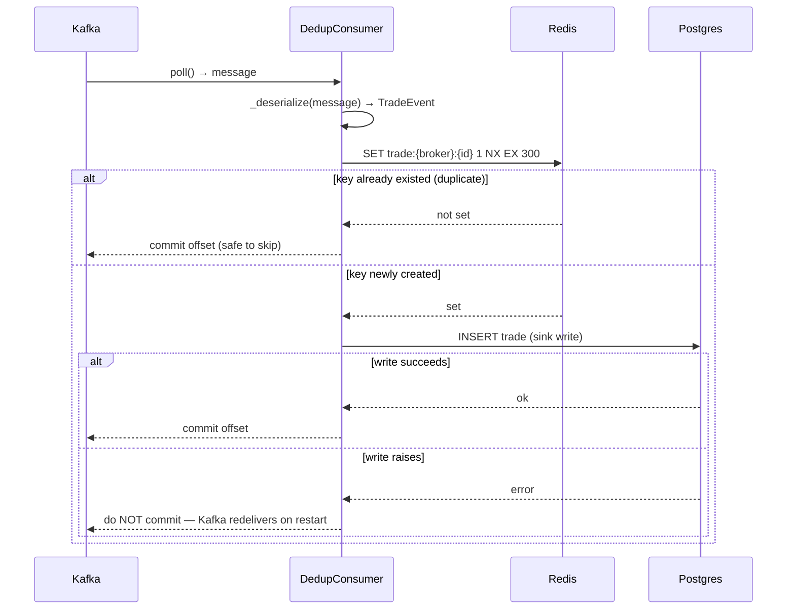

[Index](README.md) · ← Previous: [Producer](02-producer.md) · Next → [API & auth](04-api-and-auth.md)

---

# Consumer & storage

**Files**:
[`src/trade_pipeline/consumer/dedup_consumer.py`](../../trade-pipeline/src/trade_pipeline/consumer/dedup_consumer.py),
[`src/trade_pipeline/consumer/postgres_sink.py`](../../trade-pipeline/src/trade_pipeline/consumer/postgres_sink.py),
[`src/trade_pipeline/common/db_models.py`](../../trade-pipeline/src/trade_pipeline/common/db_models.py)
**Feature doc**: [docs/features/dedup-consumer.md](../features/dedup-consumer.md)
**Tests**: [`tests/consumer/`](../../trade-pipeline/tests/consumer/) (7 tests)

## What it does

Reads trade events off Kafka, drops the ones the producer intentionally duplicated, and writes
everything else to Postgres — with a hard guarantee that a crash never silently loses an event.

## Flow

## Code references — dedup logic

- [`DedupConsumer.is_duplicate(event)`](../../trade-pipeline/src/trade_pipeline/consumer/dedup_consumer.py#L51) —
  the atomic check: `redis.set(key, 1, nx=True, ex=ttl)`. This is the plan's `SETNX ... EX 300`
  spelled with redis-py's current API (see [DECISIONS.md](../DECISIONS.md) "Redis SETNX for dedup").
- [`DedupConsumer.process_message(message)`](../../trade-pipeline/src/trade_pipeline/consumer/dedup_consumer.py#L51) —
  the sequencing: dedup check → sink write → return whether to commit. Duplicates are committed past
  immediately (nothing to redo); a real write only commits *after* it succeeds.
- [`run_consumer(...)`](../../trade-pipeline/src/trade_pipeline/consumer/dedup_consumer.py#L80) — the
  real Kafka wiring: `enable.auto.commit: False`, and `consumer.commit(message=message)` is only
  called when `process_message` returns without raising. This is the load-bearing behavior for
  at-least-once delivery.
- [`DedupStats`](../../trade-pipeline/src/trade_pipeline/consumer/dedup_consumer.py#L41) — tracks
  `processed`/`duplicates` counts, exposes `dedup_hit_rate` for the (not-yet-built) observability
  layer.

## Code references — Postgres sink

- [`Trade`](../../trade-pipeline/src/trade_pipeline/common/db_models.py) ORM model — lives in
  `common/` (not under `consumer/`) specifically because it's shared: the sync consumer sink and the
  async API both use the same table definition. SQLAlchemy table definitions are engine-agnostic;
  only the Session/Engine machinery differs.
- [`make_sink(engine)`](../../trade-pipeline/src/trade_pipeline/consumer/postgres_sink.py#L52) — returns
  the callable wired as `DedupConsumer`'s sink. Uses **sync** SQLAlchemy with the `psycopg` (v3)
  driver, not async `asyncpg` — the consumer's poll loop is a plain blocking loop, not an event loop,
  so an async driver would need its own bridged event loop for no benefit. See
  [DECISIONS.md](../DECISIONS.md) "Sync psycopg for the consumer... async asyncpg for the API."
- [`DuplicateTradeError`](../../trade-pipeline/src/trade_pipeline/consumer/postgres_sink.py#L29) — a DB
  unique constraint on `(broker_id, trade_id)` is a defense-in-depth backstop behind Redis dedup;
  raised (not silently swallowed) if the two dedup layers ever disagree, since that's worth alerting
  on.

---
[Index](README.md) · ← Previous: [Producer](02-producer.md) · Next → [API & auth](04-api-and-auth.md)
