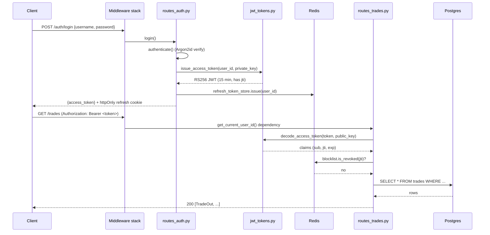
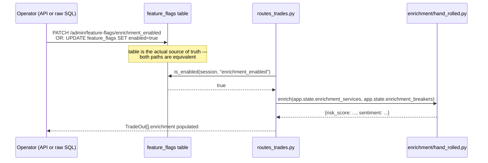

[Index](README.md) · ← Previous: [Consumer & storage](03-consumer-and-storage.md) · Next → [Enrichment](05-enrichment.md)

---

# API & auth

**Files**: everything under [`src/trade_pipeline/api/`](../../trade-pipeline/src/trade_pipeline/api/)
**Feature docs**: [docs/features/fastapi-query-layer.md](../features/fastapi-query-layer.md),
[docs/features/feature-flags.md](../features/feature-flags.md)
**Tests**: [`tests/api/`](../../trade-pipeline/tests/api/) (23 tests)

## What it does

The query/serve layer, and the vehicle for the whole security-hardening track: JWT RS256 auth with
rotation and revocation, security headers, rate limiting, audit logging, and an exception handler that
never leaks internals to a client.

## App assembly

**File**: [`src/trade_pipeline/api/main.py`](../../trade-pipeline/src/trade_pipeline/api/main.py)

[`create_app(engine, redis_client, api_settings)`](../../trade-pipeline/src/trade_pipeline/api/main.py#L53)
is a **factory**, not a module-level `app` — so tests can inject a SQLite in-memory engine and a
`fakeredis` client instead of real Postgres/Redis
([`tests/api/conftest.py`](../../trade-pipeline/tests/api/conftest.py)). It wires, in order:
`CORSMiddleware` → `AuditLogMiddleware` → `SecurityHeadersMiddleware` → `RateLimitMiddleware` →
exception handlers → routers → Prometheus instrumentation.
[`build_production_app()`](../../trade-pipeline/src/trade_pipeline/api/main.py#L109) is the real
zero-arg entrypoint `uvicorn --factory` actually points at — it assembles real Postgres/Redis
connections from config and delegates to `create_app`, kept separate so the test-friendly factory
shape of `create_app` itself never has to compromise for production wiring concerns.

## Request flow: login → authenticated read

## Code references — JWT

- [`issue_access_token`](../../trade-pipeline/src/trade_pipeline/api/auth/jwt_tokens.py#L37) /
  [`decode_access_token`](../../trade-pipeline/src/trade_pipeline/api/auth/jwt_tokens.py#L48) — RS256
  only, `algorithms=["RS256"]` always passed explicitly to `jwt.decode` (never derived from the
  token's own header) — this is the fix for both the `alg:none` attack and the RS256→HS256
  algorithm-confusion attack. See [DECISIONS.md](../DECISIONS.md) "RS256 over HS256."
- [`tests/api/auth/test_jwt_tokens.py`](../../trade-pipeline/tests/api/auth/test_jwt_tokens.py) —
  both attacks are hand-forged in the test (not built via our own `jwt.encode`, since PyJWT 2.13
  itself now refuses to construct an HS256 token from a PEM-shaped key) to simulate a real external
  attacker.

## Code references — refresh & revocation

- [`RefreshTokenStore.rotate(token)`](../../trade-pipeline/src/trade_pipeline/api/auth/refresh_tokens.py#L39) —
  uses Redis `GETDEL` so validating and consuming a refresh token is one atomic round trip; single-use,
  rotated on every call.
- [`TokenBlocklist.revoke(jti, expires_at)`](../../trade-pipeline/src/trade_pipeline/api/auth/blocklist.py#L24) —
  self-cleaning: the blocklist entry's TTL equals the token's remaining lifetime, so there's nothing to
  prune.
- [`routes_auth.py`](../../trade-pipeline/src/trade_pipeline/api/routes_auth.py) — `login` / `refresh`
  / `logout` wiring all three pieces together.

## Code references — middleware & rate limiting

- [`api/middleware.py`](../../trade-pipeline/src/trade_pipeline/api/middleware.py) —
  `SecurityHeadersMiddleware` and `AuditLogMiddleware` are **pure ASGI**, not
  `starlette.middleware.base.BaseHTTPMiddleware` — see [DECISIONS.md](../DECISIONS.md) for the
  throughput/`contextvars` tradeoff that motivated this.
- [`api/rate_limit.py`](../../trade-pipeline/src/trade_pipeline/api/rate_limit.py) —
  `RateLimitMiddleware` replaces `slowapi` (dropped after its internals triggered a Python 3.14
  deprecation warning) with a small Redis-backed fixed-window `INCR`+`EXPIRE` limiter. `/auth/*` is
  limited to 10/min, `/trades` to 100/min.
- [`api/dependencies.py`](../../trade-pipeline/src/trade_pipeline/api/dependencies.py) —
  `get_current_user_id` is the auth dependency every protected route uses; `get_session` yields a
  per-request `AsyncSession` off `request.app.state.async_session_factory`.

## Code references — password hashing

- [`api/auth/users.py`](../../trade-pipeline/src/trade_pipeline/api/auth/users.py) — Argon2id via
  `argon2-cffi`, not bcrypt (current OWASP-recommended default; see
  [DECISIONS.md](../DECISIONS.md)). One hardcoded demo account — a real user system is explicitly out
  of scope (see [features/fastapi-query-layer.md](../features/fastapi-query-layer.md)).

## Code references — feature flags + enrichment wiring

**File**: [`src/trade_pipeline/common/feature_flags.py`](../../trade-pipeline/src/trade_pipeline/common/feature_flags.py)
**Feature doc**: [docs/features/feature-flags.md](../features/feature-flags.md)

- [`is_enabled` / `set_enabled`](../../trade-pipeline/src/trade_pipeline/common/feature_flags.py#L24) —
  plain async functions reading/writing through the same per-request `AsyncSession` used everywhere
  else in the API — no separate connection, no caching layer (see [DECISIONS.md](../DECISIONS.md)).
- [`routes_admin.py`](../../trade-pipeline/src/trade_pipeline/api/routes_admin.py) — the
  `GET`/`PATCH /admin/feature-flags/{name}` convenience API, protected by the same JWT auth as
  `/trades`. Not the only way to flip a flag: a direct `UPDATE feature_flags` against Postgres works
  identically, and is tested explicitly
  ([`test_enrichment_reflects_a_direct_db_row_update`](../../trade-pipeline/tests/api/test_routes_trades.py)).
- [`_enrichment_for_response`](../../trade-pipeline/src/trade_pipeline/api/routes_trades.py#L15) /
  [`list_trades`](../../trade-pipeline/src/trade_pipeline/api/routes_trades.py#L31) — when the flag is
  on, every trade gets an `enrichment` field from the [page 5](05-enrichment.md) hand-rolled fan-out;
  the field is always present in the response shape, `null` when the flag is off, so a client never
  has to branch on whether the key exists.
- `create_app` keeps `enrichment_services`/`enrichment_breakers` on `app.state`, not created fresh per
  request — a circuit breaker built new every request would be permanently `CLOSED` regardless of
  upstream failures, defeating the point (see [page 5](05-enrichment.md) for the breaker itself).

---
[Index](README.md) · ← Previous: [Consumer & storage](03-consumer-and-storage.md) · Next → [Enrichment](05-enrichment.md)
