[Index](README.md) · ← Previous: [API & auth](04-api-and-auth.md) · Next → [Dagster archival](06-dagster-archival.md)

---

# Enrichment — hand-rolled vs Temporal

**Files**: everything under [`src/trade_pipeline/enrichment/`](../../trade-pipeline/src/trade_pipeline/enrichment/)
**Feature doc**: [docs/features/async-enrichment.md](../features/async-enrichment.md)
**Tests**: [`tests/enrichment/`](../../trade-pipeline/tests/enrichment/)

## What it does

The same problem — call 3 enrichment services in parallel, retry on timeout only, degrade gracefully
if one fails — solved two different ways, kept side by side on purpose. See
[ARCHITECTURE.md](../ARCHITECTURE.md) "Where Temporal fits" for why both exist rather than picking one.

## Shared pieces

- [`mock_services.py`](../../trade-pipeline/src/trade_pipeline/enrichment/mock_services.py) —
  [`MockServiceScript`](../../trade-pipeline/src/trade_pipeline/enrichment/mock_services.py#L23) drives
  a scripted sequence of return values/exceptions per fake service, used by both implementations'
  tests.
- [`circuit_breaker.py`](../../trade-pipeline/src/trade_pipeline/enrichment/circuit_breaker.py) — the
  plan's 3-state breaker (`CLOSED`/`OPEN`/`HALF_OPEN`), one instance per service (never shared). Note:
  [`call()`](../../trade-pipeline/src/trade_pipeline/enrichment/circuit_breaker.py#L42) takes a
  zero-arg **callable**, not an already-created coroutine — passing a live coroutine and then raising
  `CircuitOpenError` without awaiting it triggers a `RuntimeWarning: coroutine was never awaited`,
  which fails the suite under this project's warnings-as-errors policy (see
  [CODING_STANDARDS.md](../CODING_STANDARDS.md)).

## Hand-rolled version

**File**: [`hand_rolled.py`](../../trade-pipeline/src/trade_pipeline/enrichment/hand_rolled.py)

```mermaid
flowchart TD
    E[enrich&#40;services, breakers&#41;]
    G["asyncio.gather(*, return_exceptions=True)"]
    S1[call_one_service: svc A]
    S2[call_one_service: svc B]
    S3[call_one_service: svc C]
    CB{circuit open?}
    RT["_retrying_call (tenacity):<br/>retry only on TimeoutError"]
    WF["asyncio.wait_for(timeout=2.0)"]

    E --> G
    G --> S1 --> CB
    G --> S2 --> CB
    G --> S3 --> CB
    CB -->|no| RT --> WF
    CB -->|yes| Skip[raise CircuitOpenError<br/>— no network call]
```

- [`enrich(services, breakers)`](../../trade-pipeline/src/trade_pipeline/enrichment/hand_rolled.py#L64) —
  fans out with `gather(return_exceptions=True)`, **not** `TaskGroup` — `TaskGroup`'s all-or-nothing
  sibling cancellation is the wrong tool when the requirement is "return partial results per service."
  (The `TaskGroup`-vs-`gather` comparison itself lives in
  [`version_compat_demo.py`](../../trade-pipeline/src/trade_pipeline/common/version_compat_demo.py) —
  see [page 6](07-python-version-comparisons.md).)
- [`_retrying_call`](../../trade-pipeline/src/trade_pipeline/enrichment/hand_rolled.py#L32) — wraps a
  service call with `tenacity`'s `retry_if_exception_type` scoped to timeout-shaped exceptions only,
  matching the plan's explicit callout that retrying a "bad request" is wrong.
- [`call_one_service`](../../trade-pipeline/src/trade_pipeline/enrichment/hand_rolled.py#L51) — catches
  every exception (retry-exhausted timeout, non-retryable bad-request, open circuit) and converts it
  to `EnrichmentResult(data=None, error=<TypeName>)` instead of propagating — this is the graceful
  degradation.

## Temporal version

**File**: [`temporal_workflow.py`](../../trade-pipeline/src/trade_pipeline/enrichment/temporal_workflow.py)

```mermaid
flowchart TD
    W["EnrichmentWorkflow.run(service_names)"]
    SA1["start_activity: call_enrichment_service('a')"]
    SA2["start_activity: call_enrichment_service('b')"]
    RP["RetryPolicy:<br/>non_retryable_error_types=[BadRequest]"]
    Act["@activity.defn<br/>call_enrichment_service"]
    AE{ActivityError?}

    W --> SA1 --> RP --> Act
    W --> SA2 --> RP --> Act
    Act --> AE
    AE -->|yes| Degrade[EnrichmentActivityResult&#40;data=None, error=...&#41;]
    AE -->|no| Ok[EnrichmentActivityResult&#40;data=...&#41;]
```

- [`call_enrichment_service`](../../trade-pipeline/src/trade_pipeline/enrichment/temporal_workflow.py#L47) —
  the `@activity.defn`. Still a plain `async def` underneath — the decorator only changes how it's
  *registered* with a worker, so it's directly callable/awaitable in tests with zero Temporal runtime.
- [`EnrichmentWorkflow.run`](../../trade-pipeline/src/trade_pipeline/enrichment/temporal_workflow.py#L62) —
  starts every activity concurrently via `workflow.start_activity`, then awaits each handle in a loop,
  catching `ActivityError` per activity so one failure doesn't fail the whole workflow — the same
  graceful-degradation contract as the hand-rolled version, different mechanism.
- Retries here come from Temporal's own `RetryPolicy` (`non_retryable_error_types`), not `tenacity` —
  a non-retryable failure is raised from the activity as an `ApplicationError(..., non_retryable=True)`.

## Durable per-trade dispatch (the live path)

`GET /trades` doesn't call either fan-out above anymore — it only reads the `enrichment`/
`enrichment_status` already stored on the trade row. See
[docs/features/async-enrichment.md](../features/async-enrichment.md#durable-per-trade-enrichment-the-live-path)
for the full flow/design; this is just the file tour:

- [`ids.py`](../../trade-pipeline/src/trade_pipeline/enrichment/ids.py) — deterministic workflow ID.
- [`outbox.py`](../../trade-pipeline/src/trade_pipeline/enrichment/outbox.py) — polls
  `trade_enrichment_jobs`, starts one `EnrichmentWorkflow` per pending row, marks it `dispatched`.
- [`persistence.py`](../../trade-pipeline/src/trade_pipeline/enrichment/persistence.py) — a
  class-based activity (same pattern as `RefreshTokenActivities`), called once at the end of
  `EnrichmentWorkflow.run` whenever it was given a `TradeEnrichmentPayload`.
- [`services.py`](../../trade-pipeline/src/trade_pipeline/enrichment/services.py) — what
  `call_enrichment_service` actually calls in this path (real HTTP or deterministic demo handler).
- [`metrics.py`](../../trade-pipeline/src/trade_pipeline/enrichment/metrics.py) — the Temporal
  worker's own `/metrics`, same reasoning as `observability/metrics.py` for the consumer.
- `models.py` holds the dataclasses shared across the above, purely to avoid a circular import.

[`worker.py`](../../trade-pipeline/src/trade_pipeline/enrichment/worker.py) wires all of this
together: registers the activities above plus `RefreshTokenActivities` with one `Worker`, runs
`OutboxDispatcher.run()` as a concurrent task alongside it, shuts both down cleanly on
`SIGINT`/`SIGTERM`.

## How the Temporal tests actually run

[`tests/enrichment/test_temporal_workflow.py`](../../trade-pipeline/tests/enrichment/test_temporal_workflow.py)
runs real workflow executions against `temporalio.testing.WorkflowEnvironment.start_time_skipping()` —
a local time-skipping test server (downloads a small binary from `temporal.download` on first use, no
Docker/real cluster needed). Confirmed reachable and working in this environment before committing to
full workflow-level test coverage rather than settling for activity-only tests.
[`test_temporal_activities.py`](../../trade-pipeline/tests/enrichment/test_temporal_activities.py)
covers the activities with zero network dependency, calling them as plain async functions.

---
[Index](README.md) · ← Previous: [API & auth](04-api-and-auth.md) · Next → [Dagster archival](06-dagster-archival.md)
