[Index](README.md) · ← Previous: [Enrichment](05-enrichment.md) · Next → [Python version comparisons](07-python-version-comparisons.md)

---

# Dagster cold-storage archival

**Files**: [`src/trade_pipeline/dagster_pipeline/archival.py`](../../trade-pipeline/src/trade_pipeline/dagster_pipeline/archival.py),
[`src/trade_pipeline/dagster_pipeline/definitions.py`](../../trade-pipeline/src/trade_pipeline/dagster_pipeline/definitions.py)
**Feature doc**: [docs/features/dagster-archival.md](../features/dagster-archival.md)
**Tests**: [`tests/dagster_pipeline/`](../../trade-pipeline/tests/dagster_pipeline/) (9 tests)

## What it does

A scheduled batch job — separate from the consumer's per-message loop — that finds trades not yet
archived, batches up to 1000 of them, JSON-serializes and zstd-compresses the batch, writes it to a
local `archive/` directory (standing in for S3), and only then marks those rows `archived`. This is
the "cold storage" half of Layer 3 in [ARCHITECTURE.md](../ARCHITECTURE.md) — Postgres stays the hot,
queryable path; `archive/` is where old data goes to be cheap.

## Flow

```mermaid
flowchart TD
    Sched[ScheduleDefinition<br/>cron: every minute]
    Job[archival_job]
    Asset["@asset archived_trades<br/>(definitions.py)"]
    Pure["archive_pending_trades()<br/>(archival.py — plain function)"]
    Q["SELECT * FROM trades<br/>WHERE archived = false<br/>ORDER BY id LIMIT 1000"]
    Empty{any rows?}
    Comp["JSON serialize → compression.zstd.compress()"]
    Write["write archive/trades_&lt;ts&gt;_&lt;n&gt;.json.zst"]
    Mark["UPDATE trades SET archived = true<br/>WHERE id IN (...)"]

    Sched --> Job --> Asset --> Pure --> Q --> Empty
    Empty -->|no| NoOp[return ArchiveResult&#40;archived_count=0&#41;]
    Empty -->|yes| Comp --> Write --> Mark
```

Rows are only marked `archived` **after** the file write succeeds — a crash mid-run leaves those rows
untouched, so the next scheduled run simply picks them up again. Nothing is ever marked archived
without a corresponding file actually on disk.

## Code references

- [`archive_pending_trades(session, archive_dir, batch_size)`](../../trade-pipeline/src/trade_pipeline/dagster_pipeline/archival.py) —
  the entire real logic, as a **plain function with zero Dagster import** — same
  separation-of-concerns pattern as the Temporal activities on [page 5](05-enrichment.md): directly
  unit-testable without any orchestration runtime.
- `compression.zstd` (3.14 stdlib) is the compression backend — confirmed working on the installed
  interpreter before relying on it. See [PYTHON_VERSION_NOTES.md](../PYTHON_VERSION_NOTES.md) for the
  `zstandard` PyPI fallback import on 3.11–3.13.
- [`Trade.archived`](../../trade-pipeline/src/trade_pipeline/common/db_models.py) — a plain boolean
  column, not a separate high-water-mark table. See [DECISIONS.md](../DECISIONS.md) "`archived`
  boolean column over a separate high-water-mark table."
- [`read_archived_batch(path)`](../../trade-pipeline/src/trade_pipeline/dagster_pipeline/archival.py) —
  the reverse operation (decompress + parse), factored out so a future reader (e.g. the backlog's T-13
  aggregation job) doesn't duplicate this round-trip.

## The Dagster wiring itself

**File**: [`definitions.py`](../../trade-pipeline/src/trade_pipeline/dagster_pipeline/definitions.py)

- [`DbEngineResource`](../../trade-pipeline/src/trade_pipeline/dagster_pipeline/definitions.py) — a
  `ConfigurableResource` supplying the DB engine, instead of the asset loading config and building an
  engine itself. Same dependency-injection reasoning as [`create_app()`](04-api-and-auth.md) on the API
  side: lets `dg.materialize()` swap in a SQLite in-memory engine for tests, exercising the *real*
  asset/resource wiring rather than only the extracted `archive_pending_trades` logic. Confirmed
  working via an actual `dg.materialize()` call before committing to this design (see
  [DECISIONS.md](../DECISIONS.md)).
- `archived_trades` — the thin `@asset`; all it does is resolve the resources, call
  `archive_pending_trades`, and shape the result into `dg.MaterializeResult` metadata for the Dagster
  UI (row count, compressed/uncompressed bytes, compression ratio).
- `archival_schedule` — a `ScheduleDefinition` running the job every minute (a demo cadence, not
  scale-tuned — see the feature doc).
- Run it standalone: `dagster dev -m trade_pipeline.dagster_pipeline.definitions` from `trade-pipeline/`.

---
[Index](README.md) · ← Previous: [Enrichment](05-enrichment.md) · Next → [Python version comparisons](07-python-version-comparisons.md)
