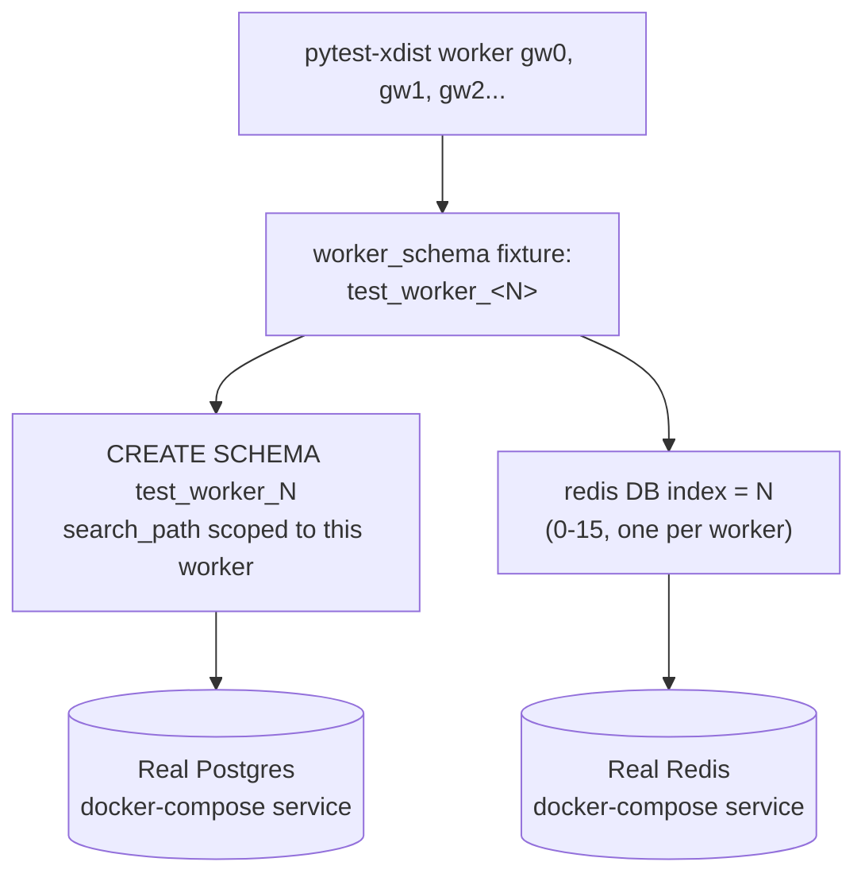

[Index](README.md) · ← Previous: [Python version comparisons](07-python-version-comparisons.md) · Next → [Index](README.md)

---

# Testing & tooling

## Running things

```bash
cd trade-pipeline
docker compose up -d postgres redis   # real services the test suite needs — see below
uv sync                               # install/update the environment
uv run pytest tests/ -n auto -q       # run the whole suite, in parallel
uv run ruff check .                   # lint (add --fix to auto-fix)
uv run pip-audit                      # dependency vulnerability scan
```

Or via the Makefile: `make services-up && make check` (`lint` + `test` + `audit`).

As of the last update to this page: **89 tests passing**, ruff clean, no known vulnerabilities, zero
deprecation warnings (enforced — see below).

## Test layout

`tests/` mirrors `src/trade_pipeline/` exactly, plus a top-level `conftest.py`:

```
tests/
  conftest.py    ← shared real-service fixtures: pg_engine, pg_async_engine,
                   pg_async_session, redis_client (see "Real services" below)
  common/        ← tests src/trade_pipeline/common/     (models, config, db_models, feature flags, version demo)
  producer/      ← tests src/trade_pipeline/producer/
  consumer/      ← tests src/trade_pipeline/consumer/    (dedup logic + Postgres sink)
  api/           ← tests src/trade_pipeline/api/         (JWT, auth routes, trades route, admin/flags)
  enrichment/    ← tests src/trade_pipeline/enrichment/  (circuit breaker, hand-rolled, Temporal)
  dagster_pipeline/ ← tests src/trade_pipeline/dagster_pipeline/ (archival, aggregation, asset wiring)
```

## Real services, not SQLite/fakeredis

**File**: [`tests/conftest.py`](../../trade-pipeline/tests/conftest.py)

This project's test suite talks to the *real* `postgres:18.4-alpine` and `redis:8.8-alpine` containers
its own [`docker-compose.yml`](../../trade-pipeline/docker-compose.yml) defines — not SQLite in-memory
or `fakeredis`, which is what earlier versions of this suite used (see
[DECISIONS.md](../DECISIONS.md) "Real Postgres/Redis in tests, not SQLite/fakeredis" for why the
switch happened: it's what actually made Postgres partitioning possible, since SQLite can't
autoincrement the composite primary key partitioning requires).



- [`pg_engine`](../../trade-pipeline/tests/conftest.py) — sync engine (psycopg), scoped to this xdist
  worker's own Postgres schema via `search_path`; drops and recreates the schema fresh for *every
  test*, then runs the same `ensure_partitions` the real consumer's `init_schema` runs — so every test
  exercises the actual partitioned schema, not a simplified stand-in.
- [`pg_async_engine`](../../trade-pipeline/tests/conftest.py) / `pg_async_session` — same worker
  schema, `asyncpg` driver, for API tests. Depends on `pg_engine` purely to guarantee schema setup runs
  first, so async-only tests don't need to remember to also request the sync fixture.
- [`redis_client`](../../trade-pipeline/tests/conftest.py) — real `redis.Redis`, pointed at a logical
  DB index (0–15) derived from the xdist worker id, flushed before and after every test.
- **Cross-worker isolation**: each `pytest-xdist` worker (`gw0`, `gw1`, ...) gets its own Postgres
  schema and Redis DB index — workers never see each other's data despite sharing the same two
  containers. **Cross-test isolation** (within one worker): fresh schema / flushed Redis DB per test,
  so test order never matters.
- Confirmed empirically, not just by design: a test that inserts a row on one xdist worker and a
  separate test asserting a fresh/empty state (potentially scheduled on a *different* worker) both
  pass reliably under `-n auto`.

## What's still faked, and why

- [`FakeMessage`](../../trade-pipeline/tests/consumer/test_dedup_consumer.py) — a minimal stand-in for
  `confluent_kafka.Message`'s `.value()` method. This isn't a service fake (no backing system to be
  faithful to) — it's just avoiding needing a real Kafka message object to test pure
  deserialization/dedup logic, same reasoning as any plain test double for a data-carrying object.
- **Kafka itself** is the one dependency not exercised by the automated suite —
  `run_producer`/`run_consumer`'s real-broker code paths are verified manually against the
  docker-compose stack (see [tasks/completed/T-17-docker-image-upgrades.md](../tasks/completed/T-17-docker-image-upgrades.md),
  which ran a genuine producer→Kafka→consumer→Postgres smoke test) rather than in CI — Kafka has no
  first-party GitHub Actions service-container support and is meaningfully more fragile to run ad hoc
  than Postgres/Redis, which do.
- **Temporal** — the opposite of faked: workflow tests run against an actual (local, time-skipping)
  Temporal test server, confirmed reachable in this environment before committing to full coverage —
  see [page 5](05-enrichment.md).

## Key config

**File**: [`trade-pipeline/pyproject.toml`](../../trade-pipeline/pyproject.toml)

- `[tool.pytest.ini_options]` — `asyncio_mode = "auto"` (async test functions don't need a decorator),
  and critically:
  ```toml
  filterwarnings = ["error::DeprecationWarning", "error::PendingDeprecationWarning"]
  ```
  This turns any deprecated API usage — ours or a dependency's — into a hard test failure instead of a
  silent warning. It's what caught `slowapi`'s internals calling a Python API slated for removal in
  3.16, which is why this project has a hand-rolled `RateLimitMiddleware` instead
  ([page 4](04-api-and-auth.md), [DECISIONS.md](../DECISIONS.md)).
- `[tool.ruff.lint]` — explicit `select = ["E", "F", "I", "UP", "B", "C4", "SIM", "RUF"]` rather than
  relying on ruff's defaults, plus a per-file exception for
  [`version_compat_demo.py`](../../trade-pipeline/src/trade_pipeline/common/version_compat_demo.py)
  (which deliberately keeps old-style syntax `UP` rules would otherwise "fix" away).
- `pytest-xdist` — parallel test execution (`-n auto`), safe under this suite's per-worker Postgres
  schema / Redis DB isolation (see above).

## CI

**File**: [`.github/workflows/ci.yml`](../../.github/workflows/ci.yml)

Runs on push/PR to `main`/`develop`, matrixed across Python 3.11–3.14, with real Postgres and Redis as
GitHub Actions `services:` containers (versions matching `docker-compose.yml` exactly) — not a
hand-rolled docker-compose-in-CI setup. `pytest tests/ -n auto -q` runs against those services the same
way local development does.

## FastAPI test client

[`tests/api/conftest.py`](../../trade-pipeline/tests/api/conftest.py) uses
`httpx.AsyncClient(transport=httpx.ASGITransport(app=app))` — the current FastAPI-recommended pattern
for genuine async tests, confirmed via research to supersede `starlette.testclient.TestClient` for
this purpose. Note: `ASGITransport` does not fire app lifespan events, which is why
`create_app()` builds all its resources (engine, Redis client) eagerly rather than in a
startup/shutdown hook.

---
[Index](README.md) · ← Previous: [Python version comparisons](07-python-version-comparisons.md) · Next → [Index](README.md)
