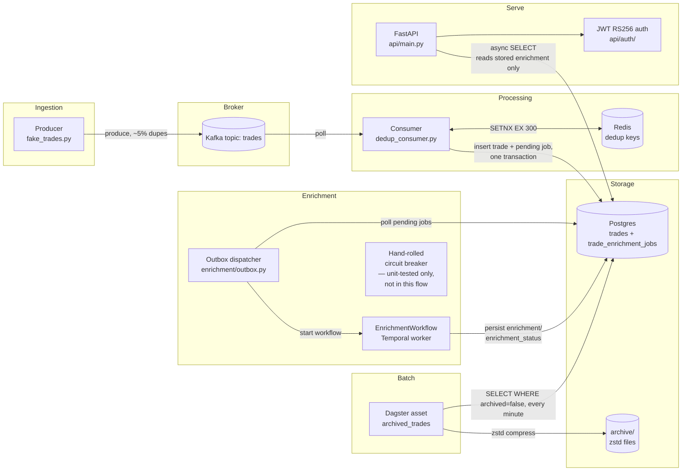

# Code walkthrough — index

A guided tour of the trade-pipeline codebase: what each piece does, how data flows between them, and
exactly where to click to see the real code. This is a companion to `../ARCHITECTURE.md` (the design)
and `../DECISIONS.md` (the "why") — this doc is the "here's the actual code, here's how it fits
together" tour.

**How to use this**: every code reference is a link with a GitHub line anchor (`file.py#L37`) — click
it to jump straight to that line on GitHub, or open the path locally. Each page has index/prev/next
navigation at the top and bottom so you can read it start to finish or jump around.

---

## Pages

| # | Page | Covers |
|---|---|---|
| 1 | [Project layout](01-project-layout.md) | Repo structure, docs system, how tasks/features/decisions relate |
| 2 | [Producer](02-producer.md) | Kafka producer, fake trade generation, duplicate simulation |
| 3 | [Consumer & storage](03-consumer-and-storage.md) | Redis dedup, manual offset commit, Postgres sink + partitioning |
| 4 | [API & auth](04-api-and-auth.md) | FastAPI app, JWT RS256, refresh tokens, middleware, rate limiting |
| 5 | [Enrichment](05-enrichment.md) | Hand-rolled circuit breaker vs Temporal workflow (comparison), plus the durable per-trade outbox dispatch that's actually live |
| 6 | [Dagster archival](06-dagster-archival.md) | Cold-storage batch job, zstd compression, resource-injected DB engine |
| 7 | [Python version comparisons](07-python-version-comparisons.md) | The old-vs-new demo module, feature by feature |
| 8 | [Testing & tooling](08-testing-and-tooling.md) | How the test suite is organized, ruff/pytest config, how to run everything |

## System overview

Enrichment is wired in durably, not as a live request-time fan-out: the consumer commits a trade and
a pending outbox job together, the Temporal worker's dispatcher starts one workflow per job, and the
workflow persists its result back to Postgres — `GET /trades` only ever reads what's already stored
(see [docs/features/async-enrichment.md](../features/async-enrichment.md)). The hand-rolled
circuit-breaker path still exists and is tested, but isn't reachable from this flow at all anymore.

---
[Index](README.md) · Next → [Project layout](01-project-layout.md)
