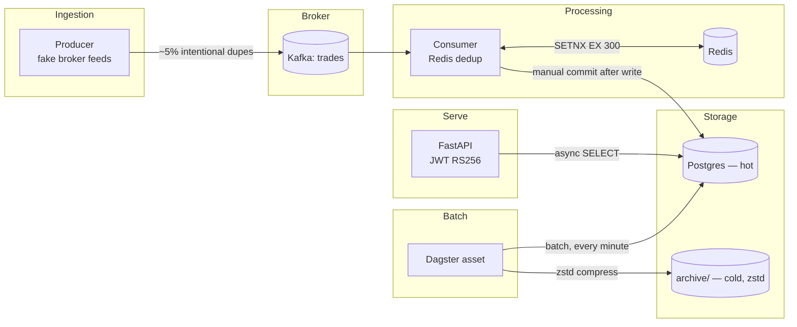

# trade-pipeline

A real-time trade event pipeline with a secure query API — built as the hands-on project half of an
8-week FAANG Python (senior) interview prep plan ([`../faang_python_full_prep.html`](../faang_python_full_prep.html)).
Every component maps to a gap identified in that plan's diagnostic: DSA aside, the weak areas were
Python internals, async/concurrency, web security, and system design — this project is those four
things, built and tested, not just described.

Full docs (architecture, decisions, task history, a guided code walkthrough with clickable
line-references) live in [`../docs/`](../docs/README.md). This README is the shorter, standalone
version for anyone who opens this directory directly.

## Problem statement

Ingest trade events from multiple broker feeds, deduplicate them (brokers redeliver), store them
queryably, and serve them through a properly secured API — with observability into whether the
pipeline is keeping up. This is deliberately the same shape of problem as the plan's own system-design
mock-interview question (Q5): ingestion → processing → storage → query → monitoring.

## Architecture



Full 5-layer breakdown, and where Temporal/Dagster fit (and deliberately don't): [`../docs/ARCHITECTURE.md`](../docs/ARCHITECTURE.md).
A component-by-component code tour with data-flow diagrams and clickable `file.py#L37` references:
[`../docs/walkthrough/README.md`](../docs/walkthrough/README.md).

## Key decisions (why, not just what)

Full rationale for each of these is in [`../docs/DECISIONS.md`](../docs/DECISIONS.md) — summarized:

| Decision | Why |
|---|---|
| Kafka, not RabbitMQ | Ordered, replayable log semantics per partition; consumer offset replay is what makes "never lose an event on crash" possible without a separate dead-letter/redelivery mechanism. |
| Redis `SETNX`-equivalent dedup, not a DB unique constraint | Sub-millisecond in-memory op keeps pace with per-event consumption; a DB round trip per duplicate is slower and noisier. |
| RS256, not HS256, for JWT | Asymmetric — only the auth service needs the private key; services that only verify tokens need just the public key, smaller blast radius if one is compromised. |
| Postgres (hot) + local zstd archive (cold), not ClickHouse | This is a learning/demo build at low volume — Postgres is genuinely queryable and keeps dependency count down. ClickHouse is the stated "what I'd change at 10x scale" answer (see below). |
| Argon2id, not bcrypt, for password hashing | Current OWASP-recommended default; verified via research mid-build, not assumed from memory. |
| Custom Redis-backed rate limiter, not `slowapi` | slowapi's own internals call a Python API slated for removal in 3.16 — caught immediately by this project's warnings-as-errors pytest config. |
| Pure ASGI middleware, not `BaseHTTPMiddleware` | ~1.8x throughput cost and known `contextvars` issues with `BaseHTTPMiddleware`, for two middlewares that run on every single request. |
| Temporal for enrichment orchestration, not the ingestion hot path | Right tool for a bounded multi-service call with retries; wrong tool (per-workflow overhead) for a tight per-Kafka-message loop. |
| Dagster for cold-storage batching, not live consumption | Scheduled/triggered batch materialization with its own observability — a different shape of problem than the consumer's per-message loop. |
| Feature flags in Postgres, not env vars | Needs to flip at runtime without redeploying/restarting every API worker; the table is genuinely the source of truth — a direct DB write works identically to the admin API. |
| `trades` range-partitioned by `timestamp` | Append-heavy time-series table — partitioning keeps each partition small and turns "drop old data" into an instant `DETACH PARTITION` instead of a slow `DELETE`. |
| Real Postgres/Redis in tests, not SQLite/fakeredis | What actually made partitioning possible — SQLite can't autoincrement the composite primary key partitioning requires. `pytest-xdist` keeps it fast via per-worker schema/DB isolation. |

## What I'd change at 10x scale

- **ClickHouse instead of Postgres** for the hot path — columnar, built for fast ingestion + analytical
  queries at volume, which is what the plan's own Q5 model answer specifies for a real deployment.
- **Kafka Streams or Flink** instead of a plain Python consumer for the processing layer, once
  throughput exceeds what a single-process consumer can dedupe/write.
- **Redis Cluster** instead of single-node Redis, once the dedup key space or throughput outgrows one
  instance.
- **Real S3** instead of the local `archive/` directory (already abstracted behind
  `dagster_pipeline/archival.py` — swapping the write target doesn't touch the batching/compression
  logic).
- Multiple API worker processes behind a load balancer — the Redis-backed rate limiter and refresh
  token store already work correctly across multiple workers (unlike `slowapi`'s default in-process
  storage, which was one of the reasons it was dropped).
- **Automatic partition rotation** — `trades` is already range-partitioned by `timestamp` (see the
  decisions table above), but pruning partitions older than N months on a schedule isn't built yet;
  a natural fit for a Dagster asset, similar in shape to the archival job.

## Python version notes (3.11 → 3.14)

This project targets `>=3.11,<3.15` deliberately and is tested against all four versions in CI
(`.github/workflows/ci.yml`). Full feature-availability table: [`../docs/PYTHON_VERSION_NOTES.md`](../docs/PYTHON_VERSION_NOTES.md).
A dedicated module runs the old-vs-new comparisons side by side, tested, not just described:
[`src/trade_pipeline/common/version_compat_demo.py`](src/trade_pipeline/common/version_compat_demo.py)
(walkthrough: [`../docs/walkthrough/07-python-version-comparisons.md`](../docs/walkthrough/07-python-version-comparisons.md)).

What would change running this on 3.11 instead of 3.14:
- `asyncio.gather()` in place of any `TaskGroup` usage stays the same either way — this codebase
  already picks `gather()` for the partial-results requirement (see `enrichment/hand_rolled.py`).
- Add `from __future__ import annotations` to modules using forward references — 3.14 defers
  annotations by default (PEP 649), 3.11–3.13 don't.
- `zstandard` (PyPI) instead of the stdlib `compression.zstd` in `dagster_pipeline/archival.py` —
  different API shape, not a drop-in (see that module's docstring).
- `TypeVar`/`Generic[T]` instead of `class Foo[T]` for any new generic classes.
- `copy.replace()` (3.13+) usage (e.g. `TradeEvent`) would need `dataclasses.replace()` instead.

## Configuration

Settings are [`pydantic-settings`](https://docs.pydantic.dev/latest/concepts/pydantic_settings/), with
every value defaulted to match this project's own `docker-compose.yml` — zero configuration needed for
a stock local setup. Precedence: real environment variables > `.env` file > defaults. Copy
[`.env.example`](.env.example) to `.env` to override anything locally; in production, real env vars set
by the deployment environment take effect automatically, no code change needed either way.

## How to run

```bash
# 1. Local services
docker-compose up -d          # Kafka (KRaft), Redis, Postgres

# 2. Environment
uv sync

# 3. Generate a local dev RSA keypair (JWT RS256) — gitignored, not committed
mkdir -p keys
openssl genrsa -out keys/private.pem 2048
openssl rsa -in keys/private.pem -pubout -out keys/public.pem

# 4. Run components (separate terminals)
uv run python -m trade_pipeline.producer.fake_trades
uv run python -m trade_pipeline.consumer.dedup_consumer   # also serves /metrics on :8001
uv run uvicorn trade_pipeline.api.main:build_production_app --factory --reload

# 5. Dagster (cold-storage archival), standalone UI
uv run dagster dev -m trade_pipeline.dagster_pipeline.definitions
```

Login with the demo account (`demo` / `trade-pipeline-demo` — see `api/auth/users.py`), then call
`GET /trades` with the returned bearer token.

### Running via Docker instead

A [`Dockerfile`](Dockerfile) builds a single image shared by every entrypoint — `docker-compose.yml`
still runs infra only (see [DECISIONS.md](../docs/DECISIONS.md)), so run the app container(s)
alongside it explicitly:

```bash
docker build -t trade-pipeline .
docker run --rm --network trade-pipeline_default \
  -e KAFKA_BOOTSTRAP_SERVERS=kafka:29092 \
  trade-pipeline python -m trade_pipeline.producer.fake_trades
# swap the last line for the consumer / uvicorn / dagster commands above to run each component
```

## Feature flags

Flags live in Postgres (`feature_flags` table), not env vars — they flip at runtime, no redeploy or
worker restart needed. Toggle via the API or a direct DB write, both work identically since the table
is the actual source of truth:

```bash
# via the API (same JWT auth as /trades)
curl -X PATCH localhost:8000/admin/feature-flags/enrichment_enabled \
  -H "Authorization: Bearer $TOKEN" -H "Content-Type: application/json" -d '{"enabled": true}'

# or directly against Postgres
psql -c "UPDATE feature_flags SET enabled = true WHERE name = 'enrichment_enabled';"
```

`enrichment_enabled` gates whether `GET /trades` attaches demo enrichment data (see
[`../docs/features/feature-flags.md`](../docs/features/feature-flags.md) and
[`../docs/features/async-enrichment.md`](../docs/features/async-enrichment.md)) — the response's
`enrichment` field is always present, `null` when the flag is off.

## Development

The test suite talks to real Postgres and Redis (`docker-compose.yml` services) — not SQLite/fakeredis
— so bring those up first:

```bash
make services-up  # docker compose up -d postgres redis
make install      # uv sync
make lint         # ruff check .
make test         # pytest tests/ -n auto -q  (pytest-xdist, isolated per worker)
make audit        # pip-audit
make check        # lint + test + audit
```

No local `make`? Run the `uv run ...` command inside each target directly — the Makefile is a thin
wrapper, not where any logic lives. CI (`.github/workflows/ci.yml`) runs the same checks across Python
3.11–3.14 on every push/PR to `main`/`develop`, with Postgres and Redis as GitHub Actions service
containers (Kafka isn't — producer/consumer code touching a real broker is verified manually, see
[`../docs/tasks/completed/T-17-docker-image-upgrades.md`](../docs/tasks/completed/T-17-docker-image-upgrades.md)).

As of the last update to this README: **100 tests passing** (serially or under `-n auto`), ruff clean,
no known vulnerabilities, zero deprecation warnings (enforced via
`filterwarnings = ["error::DeprecationWarning", ...]` in `pyproject.toml` — see
[`../docs/CODING_STANDARDS.md`](../docs/CODING_STANDARDS.md)).
